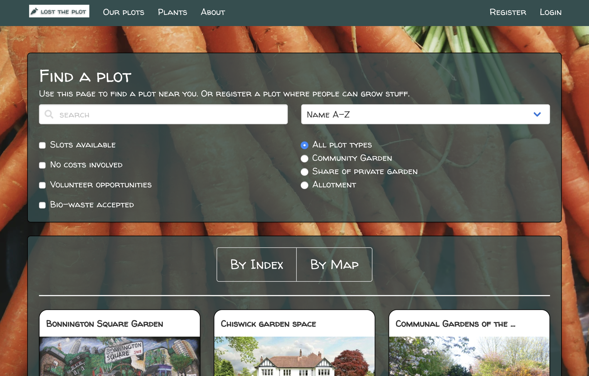
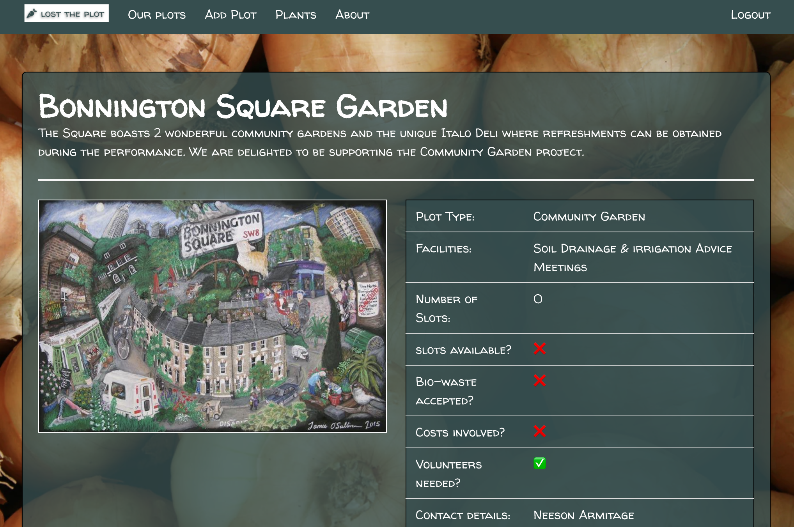
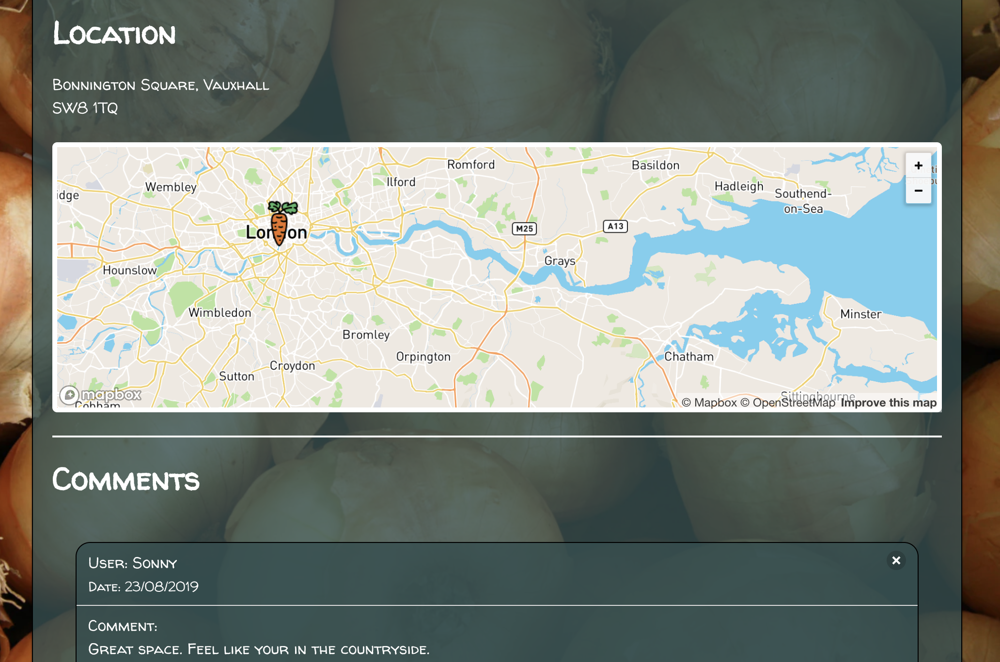
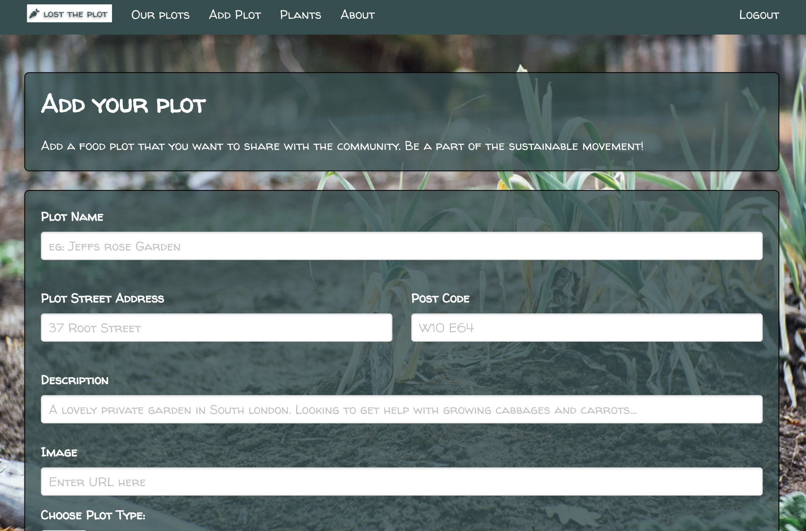

# **Project 3: Lost the plot**

## Overview
Lost the plot is a web-site primarily aimed at Londoners who are looking for a plot of land on which to grow their own food (or to help grow food, or take part in other gardening activities).

This project has been built as part of a learning module in General Assembly's Software Engineering Immersive Course using JavaScript and React on the front-end and Express and MongoDB on the back-end.

It has been developed collaboratively.

# Collaborators

Sian Alcock
Ejike Chiboka
Freddie Hoy
Prashanth Mohan

### Project duration
7 days.

Launch on [HeroKu](https://lost-the-plot.herokuapp.com).


## Brief

Technical requirements:
​
* **Build a full-stack application** by making your own backend and your own front-end
* **Use an Express API** to serve your data from a Mongo database
* **Consume your API with a separate front-end** built with React
* **Be a complete product** which most likely means multiple relationships and CRUD functionality for at least a couple of models
* **Implement thoughtful user stories/wireframes** that are significant enough to help you know which features are core MVP and which you can cut
* **Have a visually impressive design** to kick your portfolio up a notch and have something to wow future clients & employers. **ALLOW** time for this.
* **Be deployed online** so it's publicly accessible.
* **Have automated tests** for _at least_ one RESTful resource on the back-end. Improve your employability by demonstrating a good understanding of testing principals.


## Technologies Used

* HTML5
* CSS3
* JavaScript (ES6)
* React, React DOM, React MapBox, React Star Rating Component
* HashRouter, Route, Switch, Link  from React Router DOM
* Express
* MongoDB, Mongoose, Mongoose Unique Validator
* Bulma and SCSS
* Lodash
* Axios
* Dotenv
* Google Fonts, FortAwesome
* Bcrypt, JsonWebtoken
* Bluebird
* Body-parser
* Mocha, Chai, SuperTest
* Git, GitHub

## Approach Taken

We agreed on the idea fairly quickly and drafted three data models on the whiteboard, one for plots, one for users and one for plants/vegetables.  It was agreed that the first two would be enough to meet the brief and so we made those a requirement our for Minimal Viable Product (MVP).  The plants would be added later if time permitted.

Still on the whiteboard, we drew wireframes for a list of pages that would enable user registration and login plus an index page for the plots and a show page.  We also included a new/edit page to allow users to add their own plot.

We created a Trello board and documented a list of tasks.  Each task was categorized as 'must have', 'should have' or 'could have'.  Our goal was to complete all the 'must have' tasks and as many of the remainder as we could.

We made a plan to build the backend tests first and use test-driven development to build the backend.  We also made the decision to break up the backend tasks into chunks and build in pairs.  We tried to break up the work so that we could all merge the code after one chunk was built.  This worked pretty well and we were able to complete the backend tasks for MVP in about a day.

Having completed the back end, we turned to the front end.  We wanted to make the application fully responsive.  To do this, we agreed that we would build the pages in mobile view first.  Once complete, we would optimize them for tablet and desktop.

We continued in our pairs whilst we completed the pages we needed to meet MVP.  Once we had completed all MVP tasks, we could then tackle core features individually or in pairs depending on our preferences.  I took on the Index page which presented all the plots. I have expanded on this page below.

## Functionality

### Landing page
The user is introduced to the website with an attractive welcome screen that has a parallax which explains the purpose of the site.


### Index page
The index page is accessed from the Landing page when the user clicks 'Our plots'.  On first entry, the page displays all available plots, displayed in card components.

The plots can be filtered and sorted by various properties and the user can change the page view to see all the plots presented on a map.  I wanted all the filters to work together so I used the Lodash intersection to combine all the different filters and the search and sort to create a 'PlotsToDisplay' array.

The snippet below is an example of how I coded each filter.

```JavaScript
if(this.state.bioWasteBoolean) {
  filteredByBioWaste = this.state.allPlots.filter(plot => plot.bioWasteAccepted)
} else {
  filteredByBioWaste = this.state.allPlots
}

```

Then each of the filters was included in the intersection function and finally sorted according to the selection made on the page.  See snippet below.

```JavaScript
_.indexOf = _.findIndex
filteredPlots = _.intersection(this.state.allPlots, filteredByVolunteer, filteredByBioWaste, filteredByCostsInvolved, filteredByPlotType, filteredBySearchText, filteredBySlotsAvailable)

const [field, order] = this.state.sortTerm.split('|')
const sortedPlots = _.orderBy(filteredPlots, [field], [order])
return this.setState({ plotsToDisplay: sortedPlots })

```



### Show page
Clicking on a plot in the Index page, will display the Show page for the selected plot.  At the top of the page, is a picture of the plot and some key details.



Below that is a map showing the plot's location and any comments already added followed by a text box where users can add comments and rate the plot by clicking on a carrot icon.



### New / Edit pages
Provided they are logged on, users can add new plots or edit only those plots that they have created.



### About page
The About page includes a description of the application, information about the developers and acknowledgements.


### Bugs

* Clicking Delete on the Show page should present the index page but instead presents the Home page
* The images in mobile view are blurry.


## Wins and Blockers

### Win: Final deliverable looks good and works well

We are very happy with the final deliverable which meets the brief. We are particularly proud of the styling.

### Blocker: Creating two card components

xxx

### Blocker: Cleaning the group affiliation data

xx


## Future Content

Given more time, we would like to include the following capabilities:
* Make more responsive for use on mobiles
* Consume a second API to include superhero theme tunes
* Keep score between games
* Allow user to select their superhero character for the game
* Make more of the groups - eg include a separate entry page
* Combine the different filter methods on the index page so they work together
* Devise a Superhero name generator.

## What we learned

This project was such a great learning experience.  Major learning points:
* Storing values in state but not setting state too often.
* Accessing fields within the API using bracket notation so that we can build up variables using string literals.
* The API included data on Affiliated Groups.  This data needed a lot of attention (eg to remove duplicates).  This was probably our biggest challenge.
* Bulma is very powerful - you need to engage with the documentation to make the most of it and make it more customizable.
