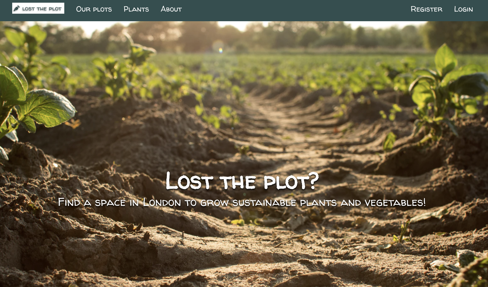
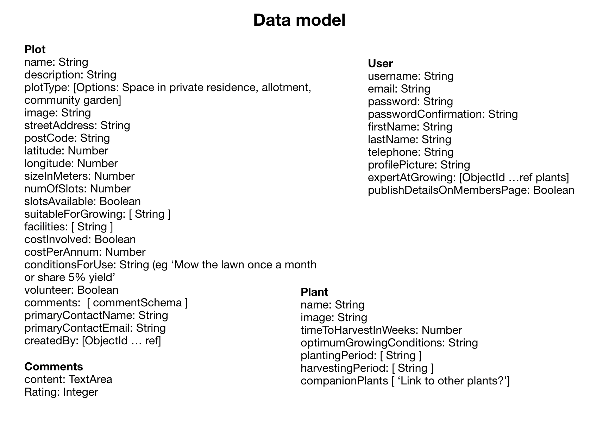
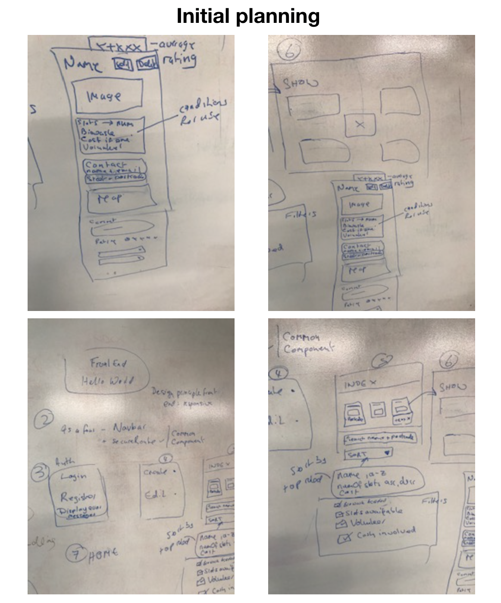
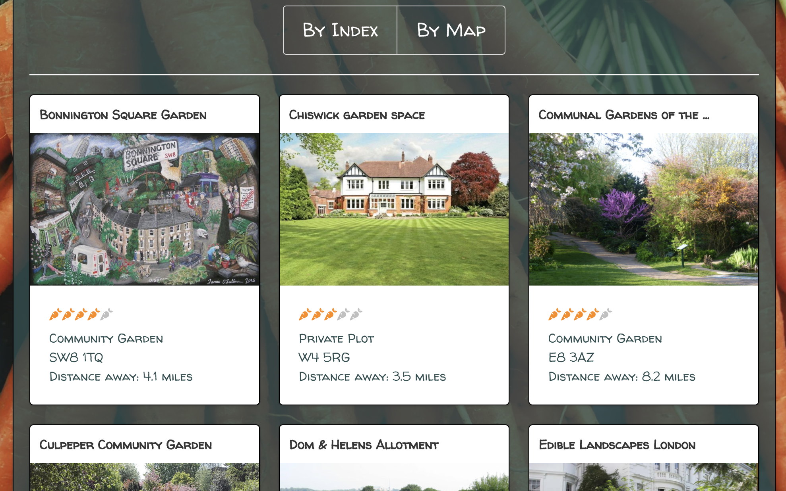
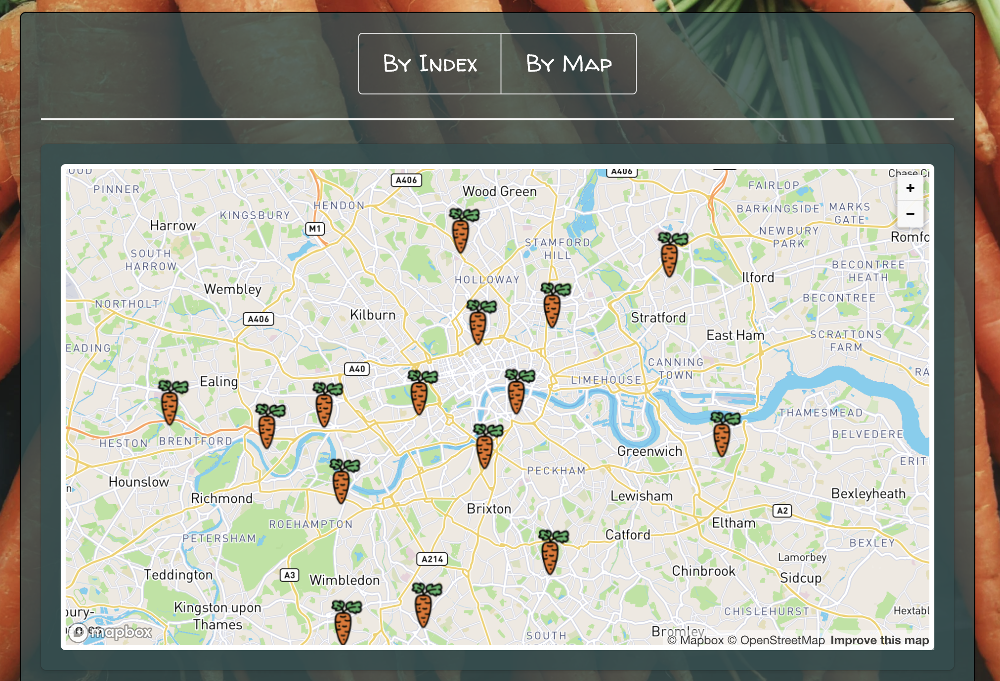
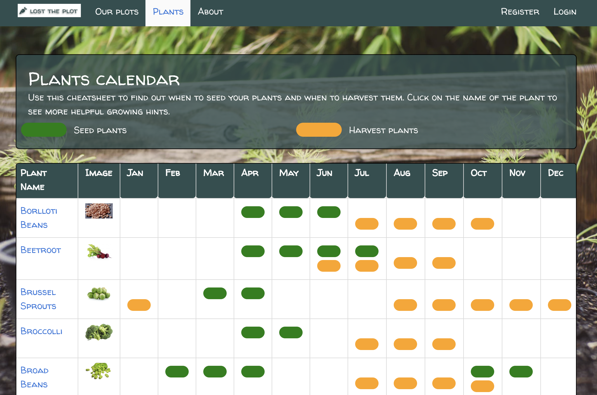
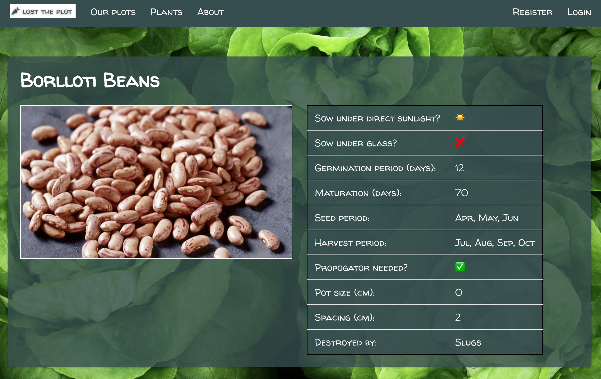
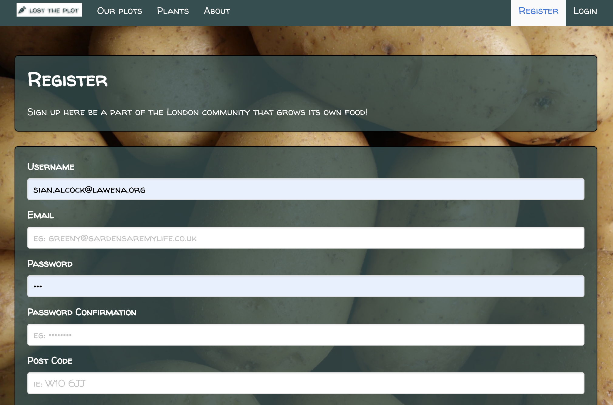

# **Project 3: Lost the plot**

## Overview

Launch on [HeroKu](https://lost-the-plot.herokuapp.com).



Lost the plot is a web-site primarily aimed at Londoners who are looking for a plot of land on which to grow their own food (or to help grow food, or take part in other gardening activities).

This project has been built as part of a learning module in General Assembly's Software Engineering Immersive Course using JavaScript and React on the front-end and Express and MongoDB on the back-end.

It has been developed collaboratively for the duration of the project.  I have made some minor changes subsequently which I have highlighted below.

### Collaborators

* Sian Alcock
* Ejike Chiboka
* Freddie Hoy
* Prashanth Mohan

### Project duration
7 days.

### Installation
1. Clone or download the repo
2. Run 'yarn init' in the CLI
3. Run 'mongod', 'yarn seed', 'yarn serve:backend' and 'yarn serve:frontend' in the CLI

### Brief

Technical requirements:
​
* **Build a full-stack application** by making your own backend and your own front-end
* **Use an Express API** to serve your data from a Mongo database
* **Consume your API with a separate front-end** built with React
* **Be a complete product** which most likely means multiple relationships and CRUD functionality for at least a couple of models
* **Implement thoughtful user stories/wireframes** that are significant enough to help you know which features are core MVP and which you can cut
* **Have a visually impressive design** to kick your portfolio up a notch and have something to wow future clients & employers. **ALLOW** time for this.
* **Be deployed online** so it's publicly accessible.
* **Have automated tests** for _at least_ one RESTful resource on the back-end. Improve your employability by demonstrating a good understanding of testing principals.

### Technologies Used

* HTML5
* CSS3
* JavaScript (ES6)
* React, React DOM, React MapBox, React Star Rating Component
* HashRouter, Route, Switch, Link  from React Router DOM
* Express
* MongoDB, Mongoose, Mongoose Unique Validator
* Bulma and SCSS
* Lodash
* Axios
* Dotenv
* Google Fonts, FortAwesome
* Bcrypt, JsonWebtoken
* Bluebird
* Body-parser
* Mocha, Chai, SuperTest
* Git, GitHub

### Approach Taken

We agreed on the idea fairly quickly and drafted three data models on the whiteboard, one for plots, one for users and one for plants/vegetables.  It was agreed that the first two would be enough to meet the brief and so we made those a requirement for our Minimal Viable Product (MVP).  The plants would be added later if time permitted.



Still on the whiteboard, we drew wireframes for a list of pages that we felt we needed for MVP.  Namely:

* Registration
* Login
* Index page, listing all plots
* Show page, for a specific plot
* Add new and Edit plot pages.



Next, we created a Trello board and documented a list of tasks.  Each task was categorized as 'must have', 'should have' or 'could have'.  Our goal was to complete all the 'must have' tasks and as many of the remainder as we could.

The backend tests were built first so that we could employ test-driven development to build the backend.  We also made the decision to break up the backend tasks into chunks and to code in pairs.  After each pair completed their allotted 'chunk', the code was merged and tested.  This worked pretty well and we were able to complete the backend tasks for MVP in about a day and a half.

Having completed the back end, we turned to the front end.  We wanted to make the application fully responsive.  To do this, we agreed that we would build the pages in mobile view first.  Once complete, we would then optimize them for desktop.

We continued coding in our pairs whilst we completed the pages we needed to meet MVP.  Once we had completed all MVP tasks, we could then tackle additional features individually or in pairs depending on our preferences.

My main individual contributions were to:
* build the filter, sorting and search capabilities on the Plot Index page, including integration with the cluster map
* devise the overall styling schema, including font, layout, colours, logo, favicon
* finalize the Plants index and show pages
* act as project co-ordinator and GitHub master.

## Functionality

In the list below, I have listed the features included on each page.  I have labelled each feature using superscript characters as follows:

<sup>1</sup> Coded by me
<sup>2</sup> Coded individually by another team member
<sup>3</sup> Coded collaboratively - mainly in pairs but in some cases, as a four.

### Landing / Home page
The user is introduced to the website with an attractive welcome screen that has a parallax which explains the purpose of the site.


#### Features
* Animated title rises up from the bottom of the page on first entry <sup>1</sup>
* Parallax with attractive pictures and descriptive text to explain the purpose of the site <sup>2</sup>

### Index page
The index page is accessed from the Landing page when the user clicks 'Our plots'.  On first entry, the page displays all available plots, displayed in card components.


#### Features
* Plots presented in cards created by a separate card component<sup>3</sup>
* Search, sort and filters<sup>1</sup>
* Cluster map accessible via tab, content of which is driven by above filters <sup>2</sup>
* Distance from plot to logged on user's location <sup>2</sup>

#### How the sorting and filtering work together
I used the Lodash intersection to combine all the different filters and sorting to create a 'PlotsToDisplay' array.

The snippet below is an example of how I coded each filter.

```JavaScript
if(this.state.bioWasteBoolean) {
  filteredByBioWaste = this.state.allPlots.filter(plot => plot.bioWasteAccepted)
} else {
  filteredByBioWaste = this.state.allPlots
}

```

Then each of the filters was included in the intersection function and finally sorted according to the selection made on the page.  See snippet below.

```JavaScript
_.indexOf = _.findIndex
filteredPlots = _.intersection(this.state.allPlots, filteredByVolunteer, filteredByBioWaste, filteredByCostsInvolved, filteredByPlotType, filteredBySearchText, filteredBySlotsAvailable)

const [field, order] = this.state.sortTerm.split('|')
const sortedPlots = _.orderBy(filteredPlots, [field], [order])
return this.setState({ plotsToDisplay: sortedPlots })

```



#### How the distance from user is calculated
The function below was coded by Freddie who is a graduate of engineering.  It calculates the distance from the user's location (as specified when he/she registers) and the location of the plot.

```JavaScript
calculateDistance(plot) {
  const user = Auth.getUser()

  const lat1 = plot.latitude
  const lon1 = plot.longitude
  const lat2 = user.latitude
  const lon2 = user.longitude

  const earthRadius = 6371e3
  const φ1 = lat1 * (Math.PI / 180)
  const φ2 = lat2 * (Math.PI / 180)
  const Δφ = (lat2-lat1) * (Math.PI / 180)
  const Δλ = (lon2-lon1) * (Math.PI / 180)

  const a = Math.sin(Δφ/2) * Math.sin(Δφ/2) +
          Math.cos(φ1) * Math.cos(φ2) *
          Math.sin(Δλ/2) * Math.sin(Δλ/2)
  const c = 2 * Math.atan2(Math.sqrt(a), Math.sqrt(1-a))
  const d = earthRadius * c
  return Math.round( (d * 0.000621371) * 10 ) / 10
}

```



### Show page
Clicking on a plot in the Index page, will display the Show page for the selected plot.


#### Features
* Display of plot image and other fields <sup>2</sup>
* Map showing plot location <sup>3</sup>
* Comments and ratings <sup>3</sup>


### New / Edit pages
Provided they are logged on, users can add new plots or edit only those plots that they have created. <sup>3</sup>


### About page
The About page includes a description of the application, information about the developers and acknowledgements. <sup>3</sup>


### Plants index
We met our minimal viable product earlier than expected and as a result decided to include a third model - the model was for plants.  We had the idea to replicate a growing cheat sheet of which I had found an example at www.anglianhome.co.uk.  Ejike and Prash worked in pairs to build the backend to support this page, including automated tests.  They also drafted the index page and included all the fields there.<sup>3</sup>

On the initial draft, there were too many fields to fit onto the page and the table scrolled horizontally.  I was unhappy with this approach so I have subsequently modified the table by removing many of the fields and instead creating a separate Show page to display the data there.<sup>1</sup>



### Plants show page
I built this page after the project was completed to display the fields that I removed from the Index page. <sup>1</sup>



### Registration and Login pages
We built the registration and login pages in pairs. <sup>3</sup>



### Common code
* Code to convert a post code into longitude and latitude (see expansion below)<sup>2</sup>
* Navigation bar<sup>3</sup>
* Footer<sup>2</sup>
* Responsive design<sup>3</sup>
* Automated tests<sup>3</sup>
* Seeded database with around 16 plots, 10 plants and 5 users<sup>3</sup>

#### How to lookup lat/long co-ordinates from post code
In the first draft of our Plot Add new/Edit pages, we had the user enter the latitude and longitude of the plot.  This seemed a cumbersome exercise so Freddie took on the task of implementing a function to convert a post code into lat/long co-ordinates using an API called postcodes.io.  The function was built in the backend in the Plot model for the plot location and in the user model for the user's location.  Below is the function from the Plot model.

```JavaScript
plotSchema.pre('validate', function getGeolocation(done) {
  if(!this.isModified('postCode')) return done()

  axios.post('https://postcodes.io/postcodes?filter=longitude,latitude', { postcodes: [this.postCode] })
    .then((res) => {
      if(!res.data.result[0].result) {
        this.invalidate('postCode', 'Invalid post code')
        return done()
      }
      const { latitude, longitude } = res.data.result[0].result
      this.latitude = latitude
      this.longitude = longitude

      done()
    })
})
```

### Bugs

* Clicking Delete on the Show page should present the index page but instead presents the Home page
* The images in mobile view are blurry.


## Wins and Blockers

### Win: Final deliverable looks good and works well

We are very happy with the final deliverable which meets the brief. We think it looks great and is packed full of features.  On the final day, we tested all features as a group and fixed all of the bugs we found except the two set out above (about 15 bugs in all).

### Blocker: Plants index page

Not so much a blocker but we ran out of time on this one.  There were too many fields in the plant model to fit neatly in the table.  Ejike and Prash who worked on this piece primarily attempted to fix a column in the table so that it could scroll horizontally but the plant name would still be visible.  They did not manage to get this working in the time.

After the project, I made a change to build a Show page that could show all the detail of each plant and limited the index page to show the seed/harvest growing calendar.

## Future Content

Given more time, we would like to include the following capabilities:
* Extend the user model so that users could message other growers
* Link the plant model to the user model so that users could set themselves up as 'expert' growers at types of Plants
* As above for the plots model so that plots that are good for growing certain types of plant can be identified.
* Allow users to create/edit/delete plants.
* Refactoring - splitting out elements of code into components to shorten pages would be good.
* Accessibility - users can't comment/rate unless logged in and they can't see the distances - ideally the app would communicate that better and encourage users to register and log in.

## What we learned

Major learning points:
* Creation of code branches using Git and GitHub
* Merging the code from the four different developers back to a single code base.
* Good communication essential for handling the above
* Pair coding to MVP ensured we delivered a whole project - building it this way required careful communication and meant that we got to grips with merging code early.
